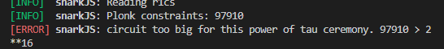

# zku.ONE C-4

**_Discord:_** mehultodi116@gmail.com  
**_Email:_** kid116#4889

## Week 1
### P1: Theoretical Background
#### Q1
Why SNARK requires a trusted setup while STARK doesn't.

SNARKs use elliptic curves to back its cryptographic security which needs a set of random initial public parameters every time a new product is launched. This randomness is generated during a so called trusted setup ceremony. This is highly secure as protocols make sure that as long as one of the parties during the ceremony act honestly, the setup is trustworthy and can't be used to generate fake proofs. In a ceremony consisting of hundreds of parties, the chances of collusion is highly unlikely but regardless, it is not completely trustless. The use of collision-resistant hash functions eliminates the need of such a trusted setup for STARKs.

#### Q2
Name two more differences between SNARK and STARK proofs.

- SNARK is based on elliptic curves and which makes it vulnerable to quantum computing whereas STARK is make use of hash-functions which makes it quantum resistant.
- STARKs have larger proof size than SNARK proof which results in longer verification time, in turn resulting in more gas fees.

### P2: Getting Started with Circom and SnarkJS
#### Q2
1 - What does the circuit in HelloWorld.circom do?

The circuit in HelloWorld.circom simply multiplies the input signals, namely a and b and produces an output signal, c which follows the constraint, c = a * b.

2 - What is a Powers of Tau ceremony? Explain why this is important in the setup of zk-SNARK applications.

The deployment of zk-SNARK circuits require the generation of certain proving and verifying keys which must be randomly generated but the said generation of such keys also produces some data which is referred to as "toxic waste". This waste must be destroyed as in the wrong hands, it may be used to fake proofs which defeats the entire purpose of using zk-SNARKs. This is known as a trusted setup as it asks for we must trust the party responsible for the generation of the keys for its safe disposal.
    
Powers of Tau is a multi-party computation which allows for such a secure trusted setup. It allows for anonymous, sequential participation creating a chain of "trusted setups". If even one of the participants can successfully eliminate the toxic waste, the ceremony may be considered successful. So far, the ceremony has 71 contributions where each one of the participants has a unique contermeasures to ensure the safe disposal of the secret. It also has contributions from prominent names such as Vitalik Buterin.

3 - How are Phase 1 and Phase 2 trusted setup ceremonies different from each other?

The Phase 1 of the trusted setup refers to the Perpetual Powers of Tau Ceremony that practically can go on forever. Phase 2 is circuit specific and is build on top of a certain state of the Powers of Tau ceremony. There is usually one more contribution made to the Phase 1 ceremony prior to Phase 2. This is known as the random beacon and is a publicly available data with high entropy. This may be the block hash at a certain height for a network which hasn't been mined yet. In Phase 2 as well, contributions are accepted from various members of community which can also go on forever and keys may be generated at any state of the setup.

#### Q3
2 - Explain what the error[T3001] means and how it arises.

As explained by the error-text, it is caused because of non-quadratic relations. circom only allows constraints of the form A*B + C = 0 where A, B and C are linear combinations of the signals.

#### Q4
1 - How is the process of compiling with PLONK different from compiling with Groth16?

Groth16 requires a trusted ceremony for each circuit whereas, the Powers of Tau ceremony acts a universal setup for PLONK.

2 - What are the practical differences between Groth16 and PLONK?

From the results of the unit test, it can be observed that PLONK is slower in verification of correction proof vs Groth16 but quick to discard a false proof. Also, it is known that the proof size for PLONK is almost 4x to that of Groth16.

#### Q5
3 - In `test/test.js`, add the unit tests for Multiplier3 for both the Groth16 and PLONK versions. Include a screenshot of all the tests passing.

### P3: Reading and Designing Circuits with Circom
#### Q1: circomlib
1 - `contracts/circuits/LessThan10.circom` implements a circuit that verifies an input is less than 10 using the LessThan template. Study how the template is used in this circuit. What does the 32 in Line 9 stand for?

The LessThan template has two input signals in[0] and in[1] and it checks whether in[0] is less than in[1]. To do so, it looks at the binary representation of the number in[0] + (1 << n) - in[1]. n is chosen such that it is more significant than any of the bits in the binary form inputs. Now, if the nth bit of the representation is 1 then obviously, the number is not less than what it is compared to and vice versa. In line-9, 32 is the value given for n.

2 - What are the possible outputs for the LessThan template and what do they mean respectively? (If you cannot figure this out by reading the code alone, feel free to compile the circuit and test with different input values.)

The possible outputs for the LessThan template are 0 and 1. 0 implies that in[0] is not less than in[1] and 1 signifies that it is.

#### Q2: circomlib-matrix
2 - `npm run test:fullProof` while inside the zkPuzzles directory to test the modified circuit raises an error. Record the error, resolve it by modifying `project/zkPuzzles/scripts/compile-circuits.sh`, and explain why it has occurred and what you did to solve the error.

This was caused because signals and components must be globally scoped in circom.

This error was encountered because the ceremony file - powersOfTau28_hez_final_16.ptau may be used to setup circuits with at most 2 ** 16 constraints which is being exceeded. We can see that a file which allows 2 ** 17 constraints will work for us. Hence, we switch to powersOfTau28_hez_final_17.ptau for this purpose.